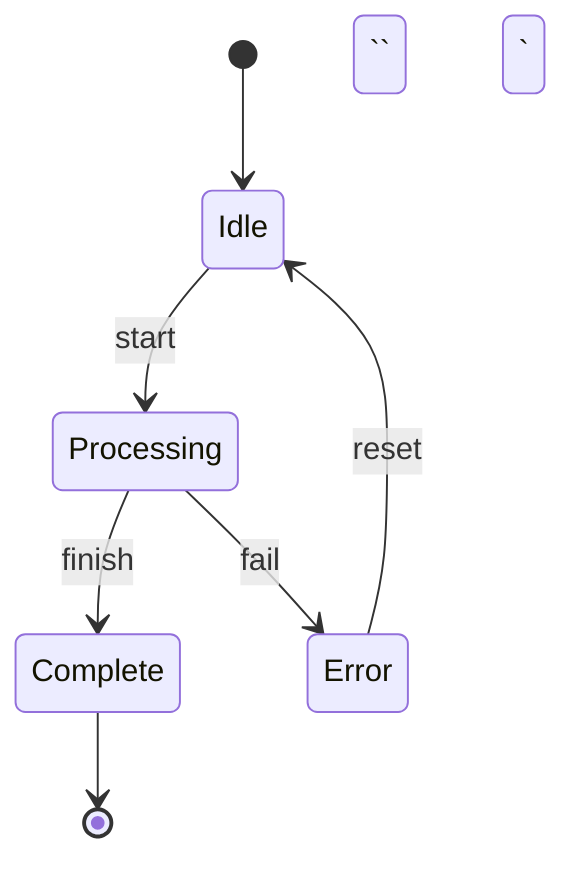

# Diagrams and Charts

Visual representations should clarify, not impress. Choose the right tool for each visualization type to balance simplicity with fidelity.

## Tool Selection

| Visualization Type | Tool | Rationale |
|--------------------|------|-----------|
| Flowcharts | Mermaid → SVG | Simple syntax, auto-layout, pre-render to SVG |
| Block diagrams | Mermaid → SVG | Boxes and arrows with automatic layout |
| Sequence diagrams | Mermaid → SVG | Clear actor/message notation |
| State machines | Mermaid → SVG | Built-in state diagram support |
| X-Y data plots | Matplotlib → SVG | Data-faithful, vector output, agent-friendly |
| Pie/bar charts | Matplotlib → SVG | Precise control over data representation |
| Complex architecture | Hand-drawn SVG | When auto-layout fails or custom positioning needed |

**The test**: Is there a simpler tool that would work? Use the lightest tool that accurately represents the content.

## Mermaid Workflow

**IMPORTANT**: Mermaid does NOT render natively in Marp. Diagrams must be pre-rendered to SVG using the Mermaid CLI (`mmdc`), then included as images.

### The Two-File Workflow

1. **`deck.md`** — Source file with inline Mermaid code blocks (for authoring)
2. **`deck.rendered.md`** — Generated file with SVG image references (for preview/build)

### Step-by-Step

```bash
# 1. Write deck with inline Mermaid
vim my-deck/deck.md

# 2. Render Mermaid blocks to SVG
./scripts/render-mermaid.sh my-deck/deck.md

# 3. Preview the rendered version
./scripts/build.sh preview my-deck/deck.rendered.md

# 4. Build final output
./scripts/build.sh pdf my-deck/deck.rendered.md my-deck/output
```

The `render-mermaid.sh` script:
- Extracts all ```mermaid code blocks
- Renders each to `img/diagram-NN.svg`
- Creates `deck.rendered.md` with image references

### Including Diagrams in Slides

Use Marp's split background syntax for two-column layouts:

```markdown
## Slide title


Text content goes here on the left.

- Bullet points
- More details
```

**Syntax breakdown:**
- `bg` — treat as background image
- `right:50%` — place on right half of slide
- `contain` — scale to fit without cropping

**Alternatives:**
- `` — image on left, text on right
- `` — narrower image column
- `` — full-slide background

## When to Visualize

Use these heuristics during deck creation to identify text that benefits from visual representation.

### Text Patterns That Signal Visualization

| Text Pattern | Visualization | Example Trigger |
|--------------|---------------|-----------------|
| Sequential steps (3+) | Flowchart | "First... then... finally..." |
| Decision with branches | Flowchart with diamond | "If X, do Y; otherwise Z" |
| Actor interactions | Sequence diagram | "User sends request to server..." |
| State transitions | State diagram | "Moves from idle to active when..." |
| Quantity comparisons | Bar chart | "A has 40%, B has 25%, C has 35%" |
| Trend over time | Line chart | "Revenue grew from 10M to 50M over 5 years" |
| Part-of-whole | Pie chart | "Budget breakdown: 60% salaries, 25% operations..." |
| Hierarchical structure | Mind map / tree | "Main topic with three subtopics..." |

### When NOT to Visualize

- **Simple lists** — bullets suffice when items are independent
- **Single comparisons** — words are clearer: "A is twice B"
- **Abstract concepts** — without clear structure, visuals mislead
- **When source has adequate visual** — transpose existing diagrams rather than regenerating

**The workflow**: During structure proposal, identify candidate passages. Propose: "Slide 4 could use a flowchart for the approval process." Get approval, then generate.

## Mermaid Syntax Reference

Write Mermaid in `deck.md` using fenced code blocks:

### Flowcharts

```markdown
```mermaid
flowchart LR
    A[Input] --> B{Decision}
    B -->|Yes| C[Process]
    B -->|No| D[Skip]
    C --> E[Output]
    D --> E
`` `
```

Direction options: `LR` (left-right), `TB` (top-bottom), `RL`, `BT`

Node shapes:
- `[text]` — rectangle
- `(text)` — rounded rectangle
- `{text}` — diamond (decision)
- `((text))` — circle
- `[(text)]` — cylinder (database)

### Sequence Diagrams

```markdown
```mermaid
sequenceDiagram
    participant U as User
    participant S as Server
    participant D as Database

    U->>S: Request data
    S->>D: Query
    D-->>S: Results
    S-->>U: Response
`` `
```

Arrow types:
- `->>` solid with arrowhead
- `-->>` dotted with arrowhead
- `--)` solid with open arrow (async)

### State Diagrams

```markdown


### Styling Mermaid

Add classes to highlight elements:

```markdown
```mermaid
flowchart LR
    A[Start] --> B[Current Step]
    B --> C[Next]

    style B fill:#e1f5fe,stroke:#0288d1,stroke-width:2px
`` `
```

## Matplotlib Charts (Pre-rendered SVG)

For data plots, generate SVG files using Python and include them as images.

### Workflow

1. Create a Python script in the deck's `img/` folder
2. Generate SVG output
3. Reference the SVG in your slide using ``

### Example: Line Chart

```python
# img/generate_charts.py
import matplotlib.pyplot as plt
import matplotlib
matplotlib.use('Agg')  # Non-interactive backend

# Data
months = ['Jan', 'Feb', 'Mar', 'Apr', 'May']
values = [10, 25, 40, 35, 50]

# Create figure
fig, ax = plt.subplots(figsize=(8, 4))
ax.plot(months, values, marker='o', linewidth=2, color='#1976d2')
ax.fill_between(months, values, alpha=0.1, color='#1976d2')

# Styling for slides
ax.set_ylabel('Growth (%)', fontsize=12)
ax.spines['top'].set_visible(False)
ax.spines['right'].set_visible(False)
ax.tick_params(labelsize=11)

# Highlight key point
ax.annotate('Peak', xy=('May', 50), xytext=('Apr', 55),
            arrowprops=dict(arrowstyle='->', color='#d32f2f'),
            fontsize=11, color='#d32f2f')

plt.tight_layout()
plt.savefig('growth_chart.svg', format='svg', transparent=True)
plt.close()
```

### Slide-Optimized Styling

Charts for slides need different treatment than charts for papers:

| Aspect | Paper/Report | Slide |
|--------|--------------|-------|
| Font size | 8-10pt | 11-14pt |
| Line weight | 1px | 2-3px |
| Gridlines | Often useful | Usually remove |
| Legend | Detailed | Minimal or inline labels |
| Data density | High | Low (highlight 1-2 points) |
| Axis labels | Complete | Essential only |

**The test**: Would someone in the back row understand this chart in 3 seconds?

### Including in Slides

```markdown
---

## Our growth accelerated in Q2


Revenue increased 40% after the platform launch.

- Q1: Baseline period
- Q2: Post-launch acceleration

---
```

## When to Use Each Approach

### Use Mermaid when:
- Showing process flow or relationships
- Diagram structure matters more than exact positioning
- The diagram is part of the explanation, not the data

### Use Matplotlib when:
- Representing actual numerical data
- Precision matters (axes, scales, proportions)
- You need to highlight specific data points
- The chart IS the evidence for your claim

### Use hand-drawn SVG when:
- Auto-layout produces poor results
- You need pixel-perfect positioning
- The diagram is highly custom (not a standard type)
- Mermaid doesn't support the diagram type

## Common Mistakes

| Mistake | Problem | Fix |
|---------|---------|-----|
| Chart with 10+ data series | Unreadable, defeats purpose | Show 2-3 key series, others in appendix |
| Mermaid for data plots | No axis control, misleading proportions | Use Matplotlib |
| Matplotlib for simple flowchart | Overkill, harder to maintain | Use Mermaid |
| Tiny labels on charts | Unreadable from distance | Increase font size, simplify |
| Rainbow color schemes | Distracting, no meaning | Use 1-2 colors with semantic meaning |
| 3D charts | Distort perception of values | Use 2D—always |
| Inline Mermaid in Marp | Won't render | Pre-render to SVG with `render-mermaid.sh` |

## Troubleshooting

**Mermaid diagrams showing as code?**
- Marp doesn't render Mermaid natively
- Run `./scripts/render-mermaid.sh deck.md` first
- Preview/build from `deck.rendered.md`, not `deck.md`

**Images not showing in preview?**
- Use `` syntax (Marp native)
- Ensure `theme:` is set in frontmatter (e.g., `theme: plato`)
- Check image path is relative to markdown file location

**Diagram too large/overlaps footer?**
- Use `contain` in image syntax to auto-scale
- Adjust column width: `right:40%` instead of `right:50%`

**Test diagrams locally:**
- Mermaid: [mermaid.live](https://mermaid.live)
- Matplotlib: Run script directly, open SVG in browser
